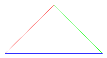

# LineDrawPy

Python port of my C++ graphics program [`LineDraw`](https://github.com/b-s-code/linedraw), with added support for coloured edges.

# Usage

`python3 src/main.py examples/edges.txt > examples/output/edges.ppm`

produces



given the following input file `edges.txt`

```
  0,   0, 100, 100, ff0000
100, 100, 200,   0, 00ff00
200,   0,   0,   0, 0000ff
```

## Output format

The output of LineDrawPy is in Portable PixMap format.  To view this image format, use either an image viewer like `feh` which supports PPM, or convert the image to another format.